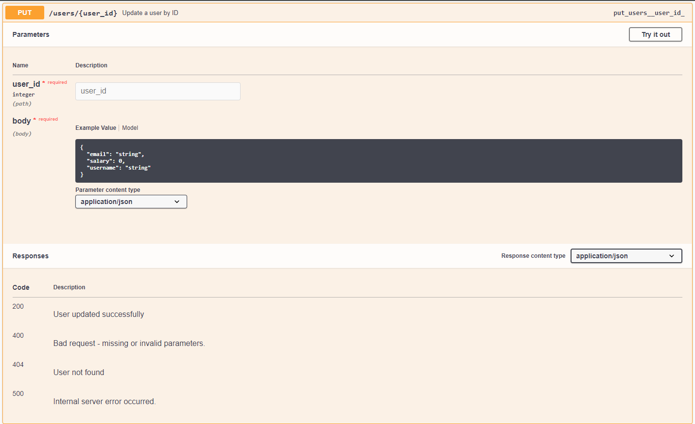
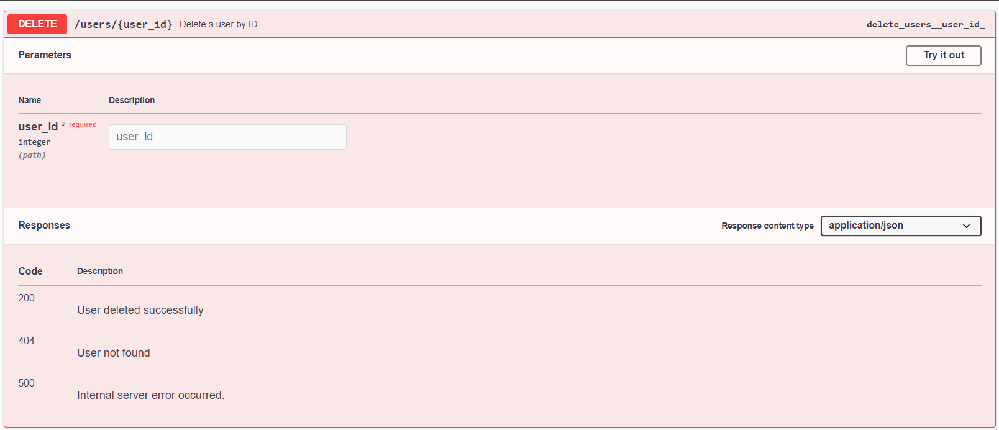

# User Management API

This is a simple Flask-based REST API for managing user records. It allows you to create, read, update, delete, and partially update user information. The API utilizes SQLAlchemy for database management and Flasgger for Swagger documentation.

## Features

- **CRUD Operations**: Create, Read, Update, and Delete users.
- **Database**: Uses SQLite as the database engine.
- **API Documentation**: Integrated Swagger documentation for easy access to API endpoints.
- **Health Check**: Endpoint to check the application status.
- **Testing**: Unit tests for API endpoints using `pytest` and `requests`.
- **Behavior-Driven Development (BDD)**: Scenario-based testing with `behave`.

## Requirements

To run this project, ensure you have the following installed:

- Python 3.x
- Virtual environment (recommended)

### Required Python Packages

- Flask
- SQLAlchemy
- Flasgger (for Swagger UI integration)
- pytest (for unit testing)
- behave (for BDD testing)

## Setup Instructions

Follow these steps to set up the project:

1. **Clone the repository**:
   ```bash
   git clone https://github.com/jeetendra29gupta/flask-user-management-api.git
   cd flask-user-management-api
   ```

2. **Create a virtual environment** (recommended):
   ```bash
   python -m venv venv
   source venv/bin/activate   # On Windows use `venv\Scripts\activate`
   ```

3. **Install the required dependencies**:
   ```bash
   pip install -r requirements.txt
   ```

4. **Run the application**:
   ```bash
   python main_app.py
   ```

   The app will be accessible at `http://localhost:8181`.


## Database Information

The application uses SQLite as its database engine. Upon running the app, it will automatically create a `user_db.db` SQLite file if it doesn't already exist.

## Running Tests

To execute the tests, use `pytest`:

```bash
pytest test_app.py
```

## API Documentation

Swagger UI is integrated for API documentation. Once the application is running, access the documentation at: `http://localhost:8181/apidocs`.


## API Endpoints

### Health Check

- **Endpoint**: `GET /health`
- **Description**: Check the status of the application.

### Get All Users

- **Endpoint**: `GET /users`
- **Response**:
  ```json
  [
      {
          "user_id": 1,
          "username": "string",
          "email": "string",
          "salary": number
      }
  ]
  ```

### Create a New User

- **Endpoint**: `POST /users`
- **Request Body**:
  ```json
  {
      "username": "string",
      "email": "string",
      "salary": number
  }
  ```
  
### Get User by ID

- **Endpoint**: `GET /users/<user_id>`
- **Response**:
  ```json
  {
      "user_id": 1,
      "username": "string",
      "email": "string",
      "salary": number
  }
  ```

### Update a User by ID

- **Endpoint**: `PUT /users/<user_id>`
- **Request Body**:
  ```json
  {
      "username": "string",
      "email": "string",
      "salary": number
  }
  ```

### Partially Update a User by ID

- **Endpoint**: `PATCH /users/<user_id>`
- **Request Body**:
  ```json
  {
      "username": "string",
      "email": "string",
      "salary": number
  }
  ```

### Delete a User by ID

- **Endpoint**: `DELETE /users/<user_id>`
- **Response**:
  ```json
  {
      "message": "User deleted successfully"
  }
  ```
  
## Error Handling

The API returns appropriate HTTP status codes for various errors:

- **400**: Bad request (e.g., missing parameters)
- **404**: Resource not found (e.g., user not found)
- **500**: Internal server error
